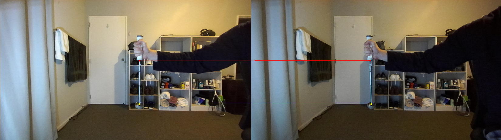
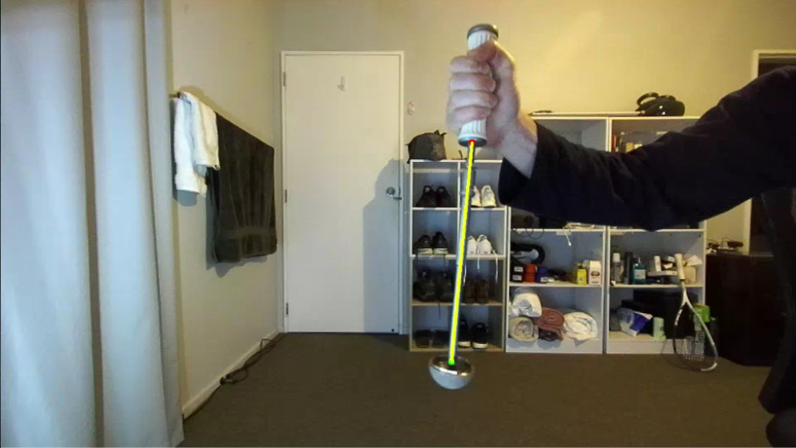
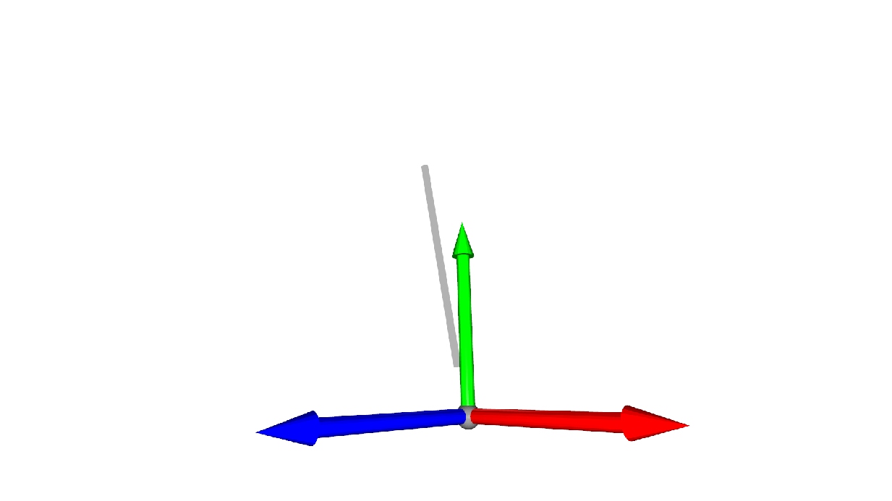

# Hip-Inserter
The goal of this project is to estimate the angles/orientation of a orthopaedic hip inserter using a pipeline of computer vision methods.

## Install
To install this project we recommend creating a conda enviroment. 

Note: To avoid dependencies version issues, use the installation order provided below.

### Operating System
These instructions are tested, and assume the Ubuntu 22.04 operating system.

### Nvidia Driver
The following cuda version pairs with the NVIDIA Driver 535. Install with the following command

`sudo apt install nvidia-driver-535`

### CUDA
CUDA is required to operate the ZED camera, and the run this project in realtime. We recommend [CUDA 12.2](https://developer.nvidia.com/cuda-12-2-0-download-archive)

### SLEAP
SLEAP is a full framework for labeling, training, and infering pose of animals via keypoint detection. We we are not working with animals, we find that this works as a general keypoint detector, while being easy to work with. The following link provides instructions on using this framework [SLEAP](https://sleap.ai/)

`conda create -y -n hipinserter -c conda-forge -c nvidia -c sleap -c anaconda sleap=1.3.3`

`conda activate hipinserter`

### ZED
We use the ZED Camera and it's SDK (version 3.8) for this project. Instructions for installing this can be found [here](https://www.stereolabs.com/developers/release/)

The python bindings can then be installed with the following line

`python /usr/local/zed/get_python_api.py`

### Other Dependencies

`pip install -r requirements.txt`

## Pipeline
Here we describe a basic overview of our pipeline. Each step is modular, so addition processing can be added between any of these steps.

### Image Retreival
First step we retreive the left and right images from our stereo camera.

### Keypoint Detection
Next we detect the pixel coordinates of keypoints in both images

### Camera to World Projection
Using stereo camera principles we use our horizontal disparity between left and right images to transfrom pixel coordinates into world coordinates.

A more detailed overview of these concepts can be found [here](https://web.stanford.edu/class/cs231a/course_notes/). (This is what I used to wrap my head around these concepts, so highly recommended)

## Visualisers
Visualers in this project are not apart of the main pipeline, but serve to demonstrate various aspects of the project.

Note: These are run off the main thread to minimise performance impact on the main pipeline

### DrawPoints
Draw the detected keypoints in left and right images, and the the correspondace via a line, useful to demonstrate disparity.

### DrawLine
Draw the detected keypoints on one image, and superimpose a line over the inserter.

### DrawAngle
Output the roll and pitch angles of the inserter.

### 3D Visualizer
Note: Currently not working on auxiliary threads (Don't use)

Render the hip inserter as a bar in a virtual 3D enviroment

